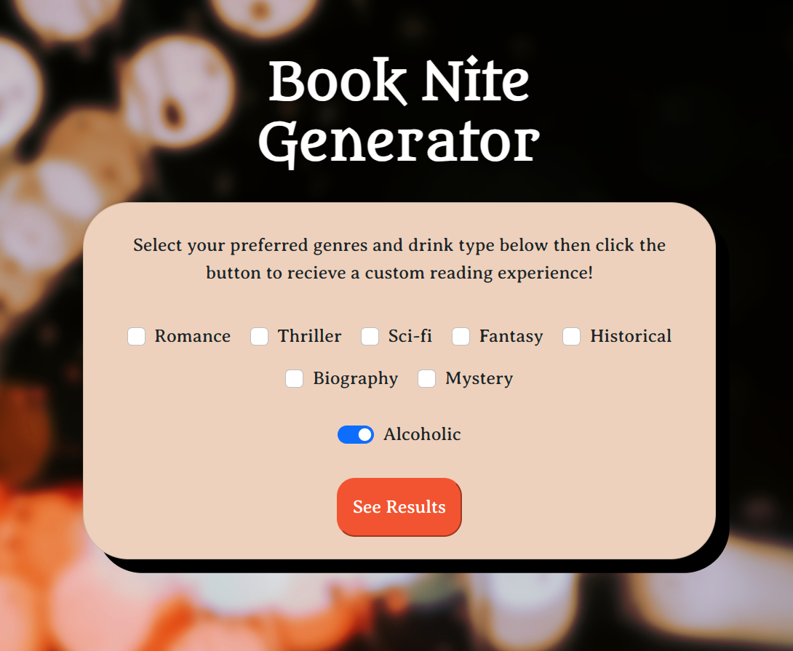

# Book Nite Generator

## Description

This simple web app was designed as a fun way for the adventerous book lover to create a custom evening reading experience based upon their preferred book genres! This custom experience comes complete with a suggested book, drink and music playlist.

## Installation
N/A 

## Usage 

Open <a href="https://abbyjo.github.io/book-nite/">this link</a> in your favorite browser to create your custom Book Nite~ 
Upon opening the page you will see a form in which you can select your preferred genres and toggle whether or not you'd prefer your drink alcoholic. Once the "See Results" button is clicked you will be taken to a secondary page where your results will be displayed for you to enjoy!
 
  

## Credits 

<a href="https://superdevresources.com/glassmorphism-ui-css/ ">This tutorial</a> helped us style the "refresh" buttons on the results page. 

<a href="https://stackoverflow.com/questions/15551779/open-link-in-new-tab-or-window">This post</a> on Stack Overflow helped with the method we used to open links in a new tab. 

Background photo by <a href="https://unsplash.com/@zinguyen?utm_source=unsplash&utm_medium=referral&utm_content=creditCopyText">Zi Nguyen</a> on <a href="https://unsplash.com/photos/U5lYNUcKVy4?utm_source=unsplash&utm_medium=referral&utm_content=creditCopyText">Unsplash</a>

Book placeholder photo by <a href="https://unsplash.com/@thilak_cm212?utm_source=unsplash&utm_medium=referral&utm_content=creditCopyText">Thilak Mohan</a> on <a href="https://unsplash.com/photos/C0eMifpRfQE?utm_source=unsplash&utm_medium=referral&utm_content=creditCopyText">Unsplash</a>

## License
N/A
